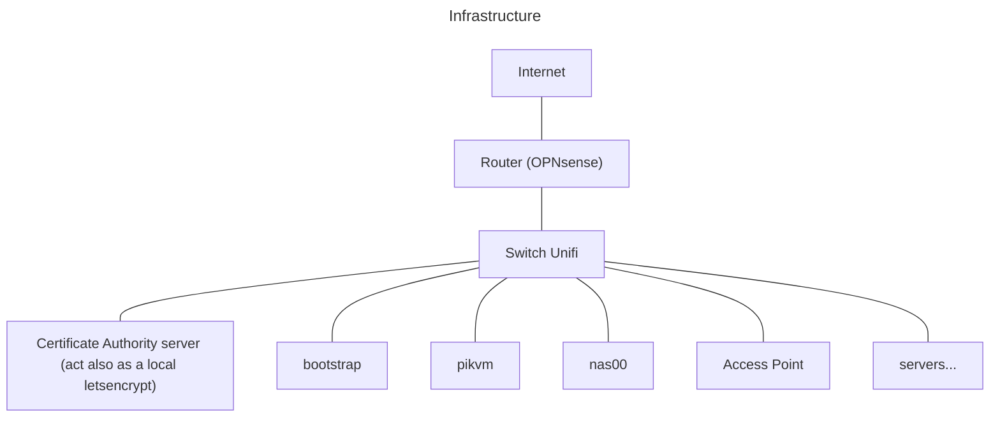

# Homelab

A repository focused on automating my homelab

> [!CAUTION]
> Please don't use that in production or even for your staging environment
> without reading properly the code. This set up is meant for my personal
> homelab and it is still in early development. Use it with caution.

## Description

Personal homelab set up with the magic of automation.

This project try to accomplish the creation and management of a homelab the
gitops way.

- [Description](#description)
- [Planification](#planification)
  - [Network](#network)
  - [Hardware](#hardware)
  - [Topology](#topology)
- [Application](#application-steps)

## Planification

The first step would be to know what kind and why is my need to have a homelab.
There are many kinds of homelab, so I need to have a global definition of what
it is. A homelab, as it names infer, is a laboratory at home. It is not only
focused on IT. Chemist, amateur radio operator, IT security and hosting can all
be considered a homelabing in the large description of the word. Homelabing is
mainly understood to be focused on IT as environment for testing, hosting your
own ISO's server or getting your own datacenter. There is two frightening
impressive reddit on that
[/HomeDatacenter](https://www.reddit.com/r/HomeDataCenter/)
and [/DataHoarder](https://www.reddit.com/r/Datahoarder).
I strongly recommend going to take a look.

As a DevOps/DevSecOps or whatever you call it nowadays, I want to experiment on
new technology and host my own contents like my own ISO's server, apps like
Google apps (to ungoogle and/or unicloud), manage my kubernetes and hypervisor
clusters.

Perfect! I have an idea of what I want and why and to answer now the how, I
need to make a plan. They said that planification is the key to success.

### Network

The network planification is a foundational part of a working infrastructure.
I will go with the basic network infrastructure but will probably do a more
complex architecture.

The basic infrastructure:

The basic network architecture:

- mgmt: Will be the default LAN and should be the management network to use to
ssh in server or reach the router and switch configuration.
- dmz: DMZ stands for demilitarized zone and will be directly accessible from
public Internet. This is where public facing service endpoints will be.
- work: This network is pretty isolated from other networks. It is an office
network for working at home.
- service: This network is the private facing of many services like
Home Assistant and nextcloud. It is accessible from mgmt and casa.
- k8s00: First kubernetes cluster network.
- casa: Home network. The one that the people that live in the house use by
default.
- iot: Network for IOT. You know how much those things are "secure" right ?
- monitoring: Network for metrics and logs.
- guest: Network for guests. Give access to Internet and some chosen services.

### Hardware

To have the proper material is a key to a long term solution. As I am not part
of the 1%, I will go with what I can, but I will add a little bit of challenges.
I would like my stack to take less energy and make less sound that is possible.
To be cost-effective over that, will require to think with a large and far view
of the project.

This is what I have for now:

- The modem is provided by my Internet Service Provider (ISP) so not really a
lot I can do here unless getting a hardware that can replace it that is more
proficient.
- The router is a fan-less Topton 12th gen with six 2.5G Ethernet ports. It runs
on [OPNsense](https://opnsense.org/). Good hardware but I had to redo the
thermal paste on the CPU.
- The switch is a standard Unifi switch 24 ports PoE. I like the simplicity of
those devices.
- The CA server is a Raspberry Pi 4 that was part of a k3s cluster and a vanilla
k8s cluster. Its purpose for now is to serve as a Certificate Authority (CA)
server and works as a personal letsencrypt with my own self-signed certificate.
- The bootstrap is a repurposed Xiaomi Mi Pro as a bootstrap for the
infrastructure. It serves as a PXE server, Unifi controller and Ansible and
Terraform agent.
- The [Pikvm](https://pikvm.org/) is a magic device that add IPMI and kvm
support to no professional hardware. It helps to fix an issue without moving my
lazy self to the machine.
- The nas was a Frankenstein until I sold a liver and bought a
[HL15](https://store.45homelab.com/configure/hl15)
from
[45Homelab](https://45homelab.com/)
([45Drives](https://www.45drives.com/))
to replace it. Its running
[Truenas Scale](https://www.truenas.com/truenas-scale/)
until I find a better solution (looking at you
[Houston](https://www.45drives.com/solutions/houston/))
- The Access Point (AP or Wi-Fi antenna) is also an Unifi Access Point U6 plus.
Can cover probably any needs in a modest apartment.
- There is six Beelink mini PC That serves as Kubernetes nodes. They run on
TalosOS ([talos.dev](https://www.talos.dev/)) with three as control plane and
three as worker.
- The "AI" machine is a custom build system with the scavenged motherboard from
the Frankenstein nas. It will run as a worker for the main kubernetes cluster.
- The "AI" laptop is a second hand laptop Asus ROG GL753V. It will run as a
worker for the main kubernetes cluster.

### Topology

## Application steps

I have a good enough basic plan, the network definition and the hardware have
their roles assigned. Let's go!

1. [Set up the router](./docs/application/1_setup_the_router.md)
2. [Start the switch](./docs/application/2_start_the_switch.md)
3. [The CA server](./docs/application/3_the_ca_server.md)
4. [The bootstrap server](./docs/application/4_the_bootstrap_server.md)
5. [The pikvm server](./docs/application/5_the_pikvm_server.md)
6. [The nas server](./docs/application/6_the_nas_server.md)
7. [The kubernetes cluster](./docs/application/7_the_kubernetes_cluster.md)
