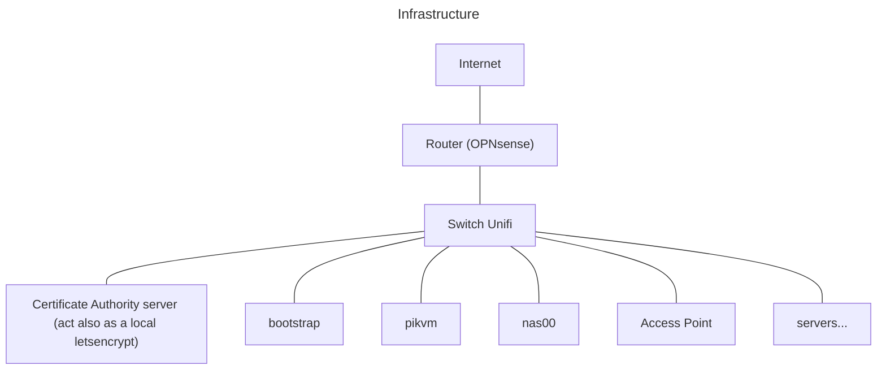
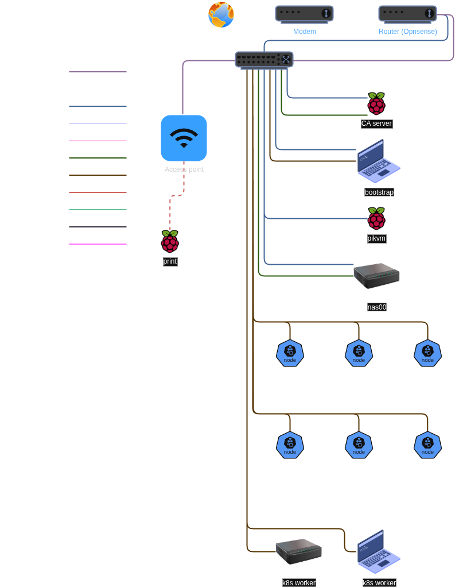

# Homelab

A repository focused on automating my homelab

> [!CAUTION]
> Please don't use that in production or even for your staging environment
> without reading properly the code. This set up is meant for my personal
> homelab and it is still in early development. Use it with caution.

## Description

Personal homelab set up with the magic of automation.

This project try to accomplish the creation and management of a homelab the
gitops way.

- [Description](#description)
- [Planification](#planification)
  - [Network](#network)
  - [Hardware](#hardware)
  - [Topology](#topology)
  - [The plan](#the-plan)
    - [Set up the router](#step-one-set-up-the-router)
    - [Start the switch](#step-two-start-the-switch)
    - [The CA server](#step-three-the-ca-server)
    - [The bootstrap server](#step-four-the-bootstrap-server)
    - [The pikvm server](#step-five-the-pikvm-server)

## Planification

The first step would be to know what kind and why is my need to have a homelab.
There are many kinds of homelab, so I need to have a global definition of what
it is. A homelab, as it names infer, is a laboratory at home. It is not only
focused on IT. Chemist, amateur radio operator, IT security and hosting can all
be considered a homelabing in the large description of the word. Homelabing is
mainly understood to be focused on IT as environment for testing, hosting your
own ISO's server or getting your own datacenter. There is two frightening
impressive reddit on that
[/HomeDatacenter](https://www.reddit.com/r/HomeDataCenter/)
and [/DataHoarder](https://www.reddit.com/r/Datahoarder).
I strongly recommend going to take a look.

As a DevOps/DevSecOps/Platform engineer or whatever you call it nowadays,
I want to experiment on new technology and host my own contents like my own
ISO's server, apps like Google apps (to ungoogle and/or unicloud), manage my
kubernetes and hypervisor clusters.

Perfect! I have an idea of what I want why and to answer now the how, I need to
make a plan. They said that planification is the key to success.

### Network

The network planification is a foundational part of a working infrastructure.
I will go with the basic network infrastructure but will probably do a more
complex architecture.

The basic infrastructure:



The basic architecture:

- mgmt: Will be the default LAN and should be the management network use to
ssh in server or reach the router and switch configuration.
- dmz: DMZ stands for demilitarized zone and will be directly accessible from
public Internet. This is where public facing service endpoints will be.
- work: This network is pretty isolated from other networks. It is an office
network for working.
- service: This network is the private facing of many services like
Home Assistant and nextcloud. It is accessible from mgmt and casa.
- k8s00: First kubernetes instance network.
- casa: Home network. The one that the people that live in the house use by
default.
- iot: Network for IOT. You know how much those things are "secure" right ?
- monitoring: Network for metrics and logs.
- guest: Network for guests. Give access to Internet and some chosen services.

### Hardware

To have the proper material is a key to a long term solution. As I am not part
of the 1%, I will go with what I can, but I will add a little bit of challenges.
I would like my stack to take less energy and make less sound that is possible.
To be cost-effective over that, will require to think with a large and far view
of the project.

This is what I have for now:

- The modem is provided by my Internet Service Provider (ISP) so not really a
lot I can do here unless getting a hardware that can replace it that is more
proficient.
- The router is a fan-less Topton 12th gen with six 2.5G Ethernet ports. It runs
on [OPNsense](https://opnsense.org/). Good hardware but I had to redo the
thermal paste on the CPU.
- The switch is a standard Unifi switch 24 ports PoE. I like the simplicity of
those devices.
- The CA server is a Raspberry Pi 4 that was part of a k3s cluster and a vanilla
k8s cluster. Its purpose for now is to serve as a Certificate Authority (CA)
server and works as a personal letsencrypt with my own self-signed certificate.
- The bootstrap is a repurposed Xiaomi Mi Pro as a bootstrap for the
infrastructure. It serves as a PXE server, Unifi controller and Ansible and
Terraform agent.
- The [Pikvm](https://pikvm.org/) is a magic device that add IPMI and kvm
support to no professional hardware. It helps to fix an issue without moving my
lazy self to the machine.
- The nas was a Frankenstein until I sold a liver and bought a
[HL15](https://store.45homelab.com/configure/hl15)
from
[45Homelab](https://45homelab.com/)
([45Drives](https://www.45drives.com/))
to replace it. Its running
[Truenas Scale](https://www.truenas.com/truenas-scale/)
until I find a better solution (looking at you
[Houston](https://www.45drives.com/solutions/houston/))
- The Access Point (AP or Wi-Fi antenna) is also an Unifi Access Point U6 plus.
Can cover probably any needs in a modest apartment.
- There is three Beelink mini PC That serves as hypervisors. They mainly work on
proxmox with one kubernetes controller and worker per devices.
- The "AI" machine is a custom build system with the scavenged motherboard from
the Frankenstein nas. It will run as a worker for the main kubernetes cluster.
- The "AI" laptop is a second hand laptop Asus ROG GL753V. It will run as a
worker for the main kubernetes cluster.

### Topology



### The plan

I have a good enough basic plan, the network definition and the hardware have
their roles assigned. Let's go!

1. [Set up the router](#step-one-set-up-the-router)
2. [Start the switch](#step-two-start-the-switch)
3. [The CA server](#step-three-the-ca-server)
4. [The bootstrap server](#step-four-the-bootstrap-server)
5. [The pikvm server](#step-five-the-pikvm-server)

#### Step one: Set up the router

The first step would be to set up the router. I made the choice of
[OPNsense](https://opnsense.org/) for many good reasons:

- Known to be pretty stable
- Firewall focused
- With a good enough UI
- Accessible to people less comfortable with network stuff
- Can do routing, firewall, dhcp, dns, vpn (wireguard), haproxy and others

I mainly followed the tutorials from
[HomeNetworkGuy](https://homenetworkguy.com/), notably:

- [Set Up a Fully Functioning Home Network Using OPNsense](https://homenetworkguy.com/how-to/set-up-a-fully-functioning-home-network-using-opnsense/)
- [How to Connect to Your Home Network via WireGuard VPN Server in OPNsense](https://homenetworkguy.com/how-to/configure-wireguard-opnsense/)
- [How to Configure IPv6 in Your Home Network with ISP such as Comcast Xfinity](https://homenetworkguy.com/how-to/configure-ipv6-opnsense-with-isp-such-as-comcast-xfinity/)
- [Harden Your Home Network Against Network Intrusions](https://homenetworkguy.com/how-to/configure-intrusion-detection-opnsense/)

> Thank you HomeNetworkGuy!

#### Step two: Start the switch

Not much to do here for now as we need an Unifi controller to manage the switch.
We will simply plug in the mgmt network from the router and the switch will
simply share it to all other ports.

#### Step three: The CA server

OK now it is finally starting to get interesting. I went with the following
tutorial on this one
[Build a Tiny Certificate Authority For Your Homelab](https://smallstep.com/blog/build-a-tiny-ca-with-raspberry-pi-yubikey/)
and did all the optional parts because it is cool. I choose to go with dietpi as
the OS.

After testing against the tutorial I went with the "automate everything" way and
write Ansible roles to do it for me in case of needed changes or just redoing it
entirely (See the Ansible folder).

> [!IMPORTANT]
> I will not go on explaining all the steps needed to be done because I assume
> that you know the basics with Ansible. *I also assume that you store your
> private variables encrypted somewhere else with a strong password.*

##### CA server the Ansible way: Set up the SD card

To be able to boot headless, we will need to insert the SD card on the
personal computer and run the playbook
[prepare_infra.yaml](./ansible/prepare_infra.yaml).

```bash
ansible-playbook \
  --vault-password-file=/PATH_TO_SECRET_FILE/secret \
  --extra-vars=@/PATH_TO_VARIABLES_FILE/variables.yaml \
  --limit ca \
  --inventory hosts.yaml \
  --ask-become-pass \
  --extra-vars ansible_user=$(whoami) \
  prepare_infra.yaml

# Then we add our user manager
ansible-playbook \
  --vault-password-file=/PATH_TO_SECRET_FILE/secret \
  --extra-vars=@/PATH_TO_VARIABLES_FILE/variables.yaml \
  --limit ca \
  --inventory hosts.yaml \
  --private-key PRIV_SSH_KEY_PATH \
  --extra-vars ansible_host=HOST_IP \
  prepare_infra.yaml
```

##### CA server the Ansible way: Ensure the server is up to standard

Now that the server is up, we need to ensure the server respect our policies. To
do so, we will need simply to run
[standardization.yaml](./ansible/standardization.yaml).

```bash
ansible-playbook \
  --vault-password-file=/PATH_TO_SECRET_FILE/secret \
  --extra-vars=@/PATH_TO_VARIABLES_FILE/variables.yaml \
  --limit ca \
  --inventory hosts.yaml \
  standardization.yaml
```

##### CA server the Ansible way: Set up and configure our CA server

All the boring stuff is done, now it is the good and fun part. We will set up a
CA server with a USB noise maker, a basic USB and a set of yubikeys!

Check the
[documentation on the role](./ansible/roles/certificate-authority-server/README.md)
about how to set up the configuration. Run [setup.yaml](./ansible/setup.yaml).

```bash
ansible-playbook \
  --vault-password-file=/PATH_TO_SECRET_FILE/secret \
  --extra-vars=@/PATH_TO_VARIABLES_FILE/variables.yaml \
  --limit ca \
  --inventory hosts.yaml \
  setup.yaml
```

##### CA server the Ansible way: Testing

The server is up and running, we just need to play with it to ensure it works as
expected. We can first get the root CA via the URL by doing a `curl --insecure
https://YOUR_CA_SERVER_HOSTNAME/roots.pem`. We can also install Cerbot locally
and try to obtain a certificate. We can set up the Opnsense router to ask for a
[certificate](https://homenetworkguy.com/how-to/replace-opnsense-web-ui-self-signed-certificate-with-lets-encrypt/).

> [!NOTE]
> We will need to set up a local Bind server to answer the step-ca call for
> internal domain.

##### Bonus: get its own certificate

Now that the CA server is up and running, it would be a nice idea to set up the
router with a certificate. For that, there will be a need to configure Bind and
ACME.

See [OPNsense automatic certificate](./docs/opnsense_automatic_certificate.md).

#### Step four: The bootstrap server

As mentioned above, the bootstrap server serves as a PXE server, Unifi Network
Application and Ansible and Terraform agent. It is the main part of our
infrastructure that manage the creation and maintenance of the infrastructure.

TODO: Find a way to enable via the butane file the docker.service.

> [!TIP]
> Once the Unifi Network Application is set, we can use the DHCP to help the
> Unifi devices to find where is the controller.
> See [Unifi l3 adoption](https://tcpip.wtf/en/unifi-l3-adoption-with-dhcp-option-43-on-pfsense-mikrotik-and-others.htm)

[](ignored)

> [!IMPORTANT]
> Sometimes Unifi devices looks for an Unifi host inside the network.
> I would recommend to set a `unifi.YOURDOMA.IN` to point it to the Unifi
> Network Application.

The OS of choice is [flatcar](https://www.flatcar.org/). I choose flatcar
because it is pretty simple. It is an immutable OS that update itself
automatically. It will be used to host containers and that is all. To set up a
flatcar system, we will need to configure what we would like it to be with what
is called a butane file. It is pretty much a yaml file wrapped with a butane
specification. Once done, the butane file should be transformed to an ignition
file which is a json file of the yaml one (there are some differences but I will
let you learn that by yourself). The next step is to upload it to install
flatcar in the bootstrap server.

##### Bootstrap: Butane to ignition

Once the butane file is ready to be used I use an ansible-playbook to transform
it. See the
[documentation on the role](./ansible/roles/flatcar/tasks/README.md).
Run [prepare_infra.yaml](./ansible/prepare_infra.yaml).

```bash
ansible-playbook \
  --vault-password-file=/PATH_TO_SECRET_FILE/secret \
  --extra-vars=@/PATH_TO_VARIABLES_FILE/variables.yaml \
  --limit bootstrap \
  --inventory hosts.yaml \
  --tags flatcar_butane \
  prepare_infra.yaml
```

##### Bootstrap: Start flatcar on Bootstrap

Go to the [flatcar](https://www.flatcar.org/) website, download an image and
upload it in a USB key. Once done, start the Bootstrap server via the USB key.

##### Bootstrap: Start the ignition file server

Now we need to share the ignition file to the Bootstrap server. To do so, the
simple way would be to share the file via another USB key or to start an NGINX
server to retrieve our file.

```bash
# Go to the folder that contain the ignition file
cd flatcar

# Get the iP of the nginx server
ip a

# Start the nginx server
sudo podman run \
  --interactive \
  --tty \
  --rm \
  --name deploy_flatcar \
  --volume ./:/usr/share/nginx/html:ro \
  --publish 8080:80 \
  docker.io/nginx
```

##### Bootstrap: Download the ignition file and install the system

On the Bootstrap server curl the ignition file then start the installation.

```bash
# Curl the ignition file
curl http://IP_OF_THE_NGINX_SERVER:8080/bootstrap.ignition.json \
  --output /tmp/bootstrap.ignition.json

# Install flatcar
sudo flatcar-install \
  -d /dev/DISK_WHERE_TO_INSTALL_FLATCAR \
  -C stable \
  -i /tmp/bootstrap.ignition.json

# Last step is to reboot and remove the USB key
sudo reboot
```

##### Bootstrap: Install the bootstrap system

Now the only thing to do is to install netbootxyz, Unifi network application and
semaphore (Ansible and Terrafom/Tofu) via containers. All the endpoints will
be managed by Traefik and the auto-update of container versions will be managed
by beatkind/watchtower. The official Watchtower seems to not be maintained
anymore. Refer to the documentations on
[directories_files](./ansible/roles/directories_files/README.md) and
[docker_mgmt](./ansible/roles/docker_mgmt/README.md).
Run [setup.yaml](./ansible/setup.yaml).

```bash
ansible-playbook \
  --vault-password-file=/PATH_TO_SECRET_FILE/secret \
  --extra-vars=@/PATH_TO_VARIABLES_FILE/variables.yaml \
  --limit bootstrap \
  --inventory hosts.yaml \
  setup.yaml
```

#### Step five: the pikvm server

There is only two steps here. The first one is to Install the pivkm image with
some custom configuration inside the SD card. The second is to set up the server
with the configuration needed.

##### Pikvm: Install pikvm in a SD card

```bash
ansible-playbook \
  --vault-password-file=/PATH_TO_SECRET_FILE/secret \
  --extra-vars=@/PATH_TO_VARIABLES_FILE/variables.yaml \
  --inventory hosts.yaml \
  --tags setup_pikvm \
  prepare_infra.yaml
```

##### Pikvm: Configure pikvm

```bash
ansible-playbook \
  --vault-password-file=/PATH_TO_SECRET_FILE/secret \
  --extra-vars=@/PATH_TO_VARIABLES_FILE/variables.yaml \
  --inventory hosts.yaml \
  --limit pikvm \
  setup.yaml
```
